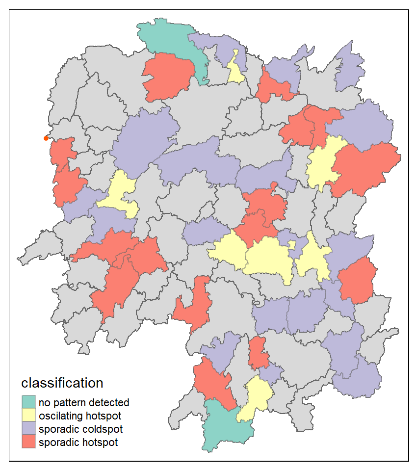
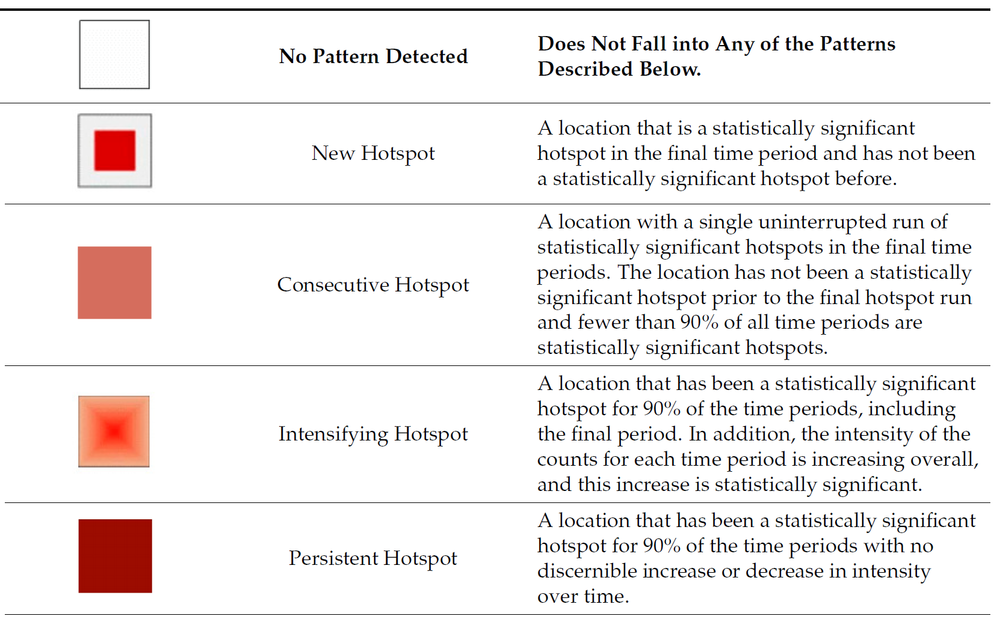
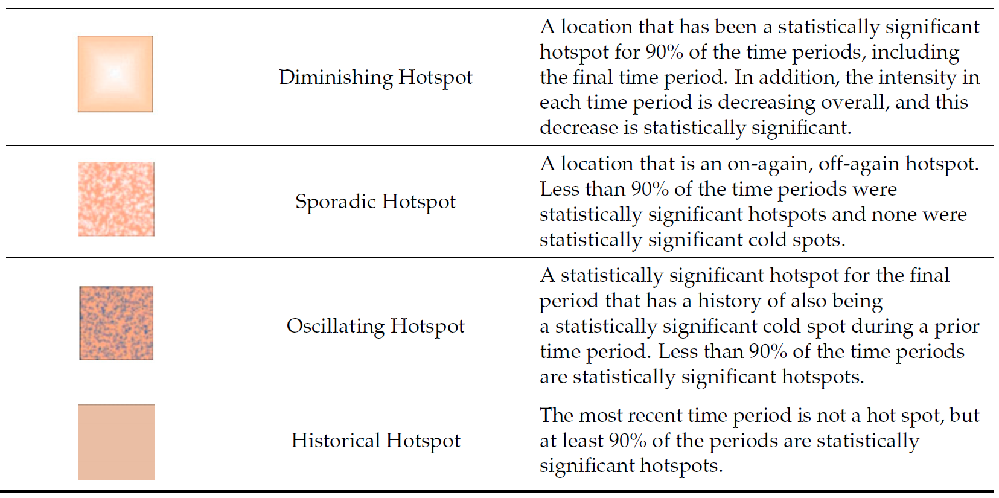
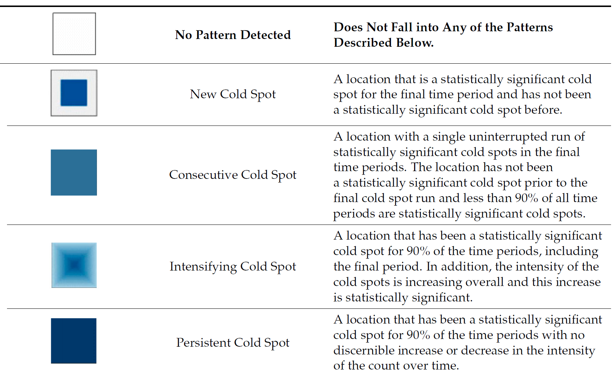
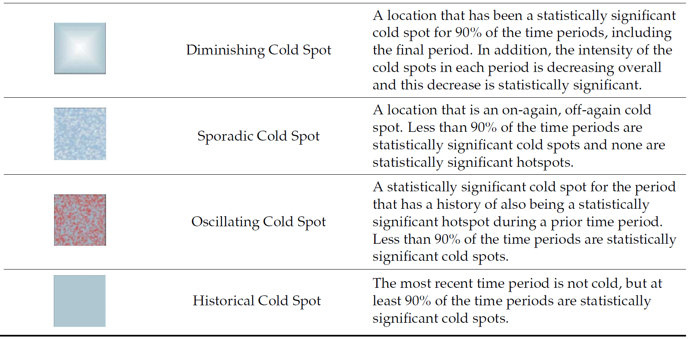

## Overview

Emerging Hot Spots Analysis (EHSA) is a spatio-temporal statistical technique that identifies and categorizes areas where clusters of high or low values of a phenomenon are developing, intensifying, or diminishing over time. It combines the Getis-Ord Gi\* statistic, which measures spatial clustering, with the Mann-Kendall trend test, a non-parametric trend analysis, to detect trends in these clusters within a "space-time cube" of data. This process allows for the detection of patterns such as new hot spots, persistent trends, or diminishing cold spots across different confidence levels.

The analysis consist of four main steps:

- Building a space-time cube,
- Calculating Getis-Ord local Gi\* statistic for each bin by using an FDR correction,
- Evaluating these hot and cold spot trends by using Mann-Kendall trend test,
- Categorising each study area location by referring to the resultant trend z-score and p-value for each location with data, and with the hot spot z-score and p-value for each bin.

::: callout-important
It is highly recommended to read [Emerging Hot Spot Analysis](https://sfdep.josiahparry.com/articles/understanding-emerging-hotspots) before you continue the exercise.
:::

:::: :::::
::: {.column width="50%"}

:::
::::

## Getting started

### Installing and Loading the R Packages

As usual, `p_load()` of **pacman** package will be used to check if the necessary packages have been installed in R, if yes, load the packages on R environment.

Six R packages are need for this in-class exercise, they are: sf, sfdep, tmap, plotly, and tidyverse.

::: {style="font-size: 1.5em"}
```{r}
pacman::p_load(sf, sfdep, tmap, 
               plotly, tidyverse, 
               Kendall)
```
:::

## The Data

For the purpose of this in-class exercise, the Hunan data sets will be used. There are two data sets in this use case, they are:

- Hunan, a geospatial data set in ESRI shapefile format, and
- Hunan_GDPPC, an attribute data set in csv format.

Before getting started, reveal the content of *Hunan_GDPPC.csv* by using Notepad and MS Excel.

### Importing geospatial data

In the code chunk below, `st_read()` of **sf** package is used to import *Hunan* shapefile into R.

```{r}
hunan <- st_read(
  dsn = "chap11/data/geospatial", 
  layer = "Hunan") %>% 
  st_transform(crs = 32650)
```

### Importing attribute table

In the code chunk below, `read_csv()` of **readr** is used to import *Hunan_GDPPC.csv* into R.

```{r}
GDPPC <- read_csv(
  "chap11/data/aspatial/Hunan_GDPPC.csv")
```

## Creating a Time Series Cube

Before getting started, students must read this [article](https://sfdep.josiahparry.com/articles/spacetime-s3.html) to learn the basic concept of spatio-temporal cube and its implementation in sfdep package.

In the code chunk below, [`spacetime()`](https://sfdep.josiahparry.com/reference/spacetime.html) of sfdep ised used to create an spatio-temporal cube.

```{r}
GDPPC_st <- spacetime(GDPPC, hunan,
                      .loc_col = "County",
                      .time_col = "Year")
```

Next, `is_spacetime_cube()` of sfdep package will be used to verify if GDPPC_st is indeed an space-time cube object.

```{r}
is_spacetime_cube(GDPPC_st)
```

The **TRUE** return confirms that *GDPPC_st* object is indeed an time-space cube.

## Computing Gi\*

Next, we will compute the local Gi\* statistics.

### Deriving the spatial weights

The code chunk below will be used to identify neighbors and to derive an inverse distance weights.

```{r}
GDPPC_nb <- GDPPC_st %>%
  activate("geometry") %>%
  mutate(nb = include_self(
    st_contiguity(geometry)),
    wt = st_inverse_distance(nb, 
                             geometry, 
                             scale = 1,
                             alpha = 1),
    .before = 1) %>%
  set_nbs("nb") %>%
  set_wts("wt")
```

::: callout-tip
# Things to learn from the code chunk above

- `activate()` of dplyr package is used to activate the geometry context
- `mutate()` of dplyr package is used to create two new columns *nb* and *wt*.
- Then we will activate the data context again and copy over the nb and wt columns to each time-slice using `set_nbs()` and `set_wts()`
  - row order is very important so do not rearrange the observations after using `set_nbs()` or `set_wts()`.
:::

Note that this dataset now has neighbors and weights for each time-slice.

## Computing Gi\*

We can use these new columns to manually calculate the local Gi\* for each location. We can do this by grouping by *Year* and using `local_gstar_perm()` of sfdep package. After which, we `use unnest()` to unnest *gi_star* column of the newly created *gi_starts* data.frame.

```{r}
gi_stars <- GDPPC_nb %>% 
  group_by(Year) %>% 
  mutate(gi_star = local_gstar_perm(
    GDPPC, nb, wt)) %>% 
  tidyr::unnest(gi_star)
```

## Mann-Kendall Test

A **monotonic series** or function is one that only increases (or decreases) and never changes direction. So long as the function either stays flat or continues to increase, it is monotonic.

H0: No monotonic trend

H1: Monotonic trend is present

**Interpretation**

- Reject the null-hypothesis null if the p-value is smaller than the alpha value (i.e. 1-confident level)
- Tau ranges between -1 and 1 where:
  - -1 is a perfectly decreasing series, and
  - 1 is a perfectly increasing series.

::: callout-important
You are encouraged to read [Mann-Kendall Test For Monotonic Trend](https://vsp.pnnl.gov/help/vsample/design_trend_mann_kendall.htm) to learn more about the concepts and method of Mann-Kendall test..
:::

### Mann-Kendall Test on Gi

With these Gi\* measures we can then evaluate each location for a trend using the Mann-Kendall test. The code chunk below uses Changsha county.

```{r}
cbg <- gi_stars %>% 
  ungroup() %>% 
  filter(County == "Changsha") |> 
  select(County, Year, gi_star)
```

Next, we plot the result by using ggplot2 functions.

```{r}
#| eval: false
ggplot(data = cbg, 
       aes(x = Year, 
           y = gi_star)) +
  geom_line() +
  theme_light()
```

```{r}
#| echo: false
ggplot(data = cbg, 
       aes(x = Year, 
           y = gi_star)) +
  geom_line() +
  theme_light()
```

### Interactive Mann-Kendall Plot

We can also create an interactive plot by using `ggplotly()` of **plotly** package.

```{r}
#| eval: false
p <- ggplot(data = cbg, 
       aes(x = Year, 
           y = gi_star)) +
  geom_line() +
  theme_light()

ggplotly(p)
```

```{r}
#| echo: false
p <- ggplot(data = cbg, 
       aes(x = Year, 
           y = gi_star)) +
  geom_line() +
  theme_light()

ggplotly(p)
```

### Printing Mann-Kendall test report

```{r}
cbg %>%
  summarise(mk = list(
    unclass(
      Kendall::MannKendall(gi_star)))) %>% 
  tidyr::unnest_wider(mk)
```

In the above result, **sl** is the p-value. With reference to the results, we will reject the hypothesis null and infer that a slight upward trend.

### Mann-Kendall test data.frame

We can replicate this for each location by using `group_by()` of dplyr package.

```{r}
ehsa <- gi_stars %>%
  group_by(County) %>%
  summarise(mk = list(
    unclass(
      Kendall::MannKendall(gi_star)))) %>%
  tidyr::unnest_wider(mk)
head(ehsa)
```

### Mann-Kendall test data.frame

We can also sort to show significant emerging hot/cold spots

```{r}
emerging <- ehsa %>% 
  arrange(sl, abs(tau)) %>% 
  slice(1:10)
head(emerging)
```

## Performing Emerging Hotspot Analysis

Lastly, we will perform EHSA analysis by using [`emerging_hotspot_analysis()`](https://sfdep.josiahparry.com/reference/emerging_hotspot_analysis.html) of sfdep package. It takes a spacetime object x (i.e. GDPPC_st), and the quoted name of the variable of interest (i.e. GDPPC) for .var argument. The k argument is used to specify the number of time lags which is set to 1 by default. Lastly, nsim map numbers of simulation to be performed.

```{r}
ehsa <- emerging_hotspot_analysis(
  x = GDPPC_st, 
  .var = "GDPPC", 
  k = 1, 
  nsim = 99
)
```

### Visualising the distribution of EHSA classes

In the code chunk below, ggplot2 functions is used to reveal the distribution of EHSA classes as a bar chart.

```{r}
ggplot(data = ehsa,
       aes(x = classification)) +
  geom_bar()

```

Figure above shows that sporadic cold spots class has the high numbers of county.

------------------------------------------------------------------------

### Visualising EHSA

In this section, you will learn how to visualise the geographic distribution EHSA classes. However, before we can do so, we need to join both *hunan* and *ehsa* together by using the code chunk below.

```{r}
hunan_ehsa <- hunan %>%
  left_join(ehsa,
            by = join_by(County == location))

```

Next, tmap functions will be used to plot a categorical choropleth map by using the code chunk below.

```{r}
#| eval: false
ehsa_sig <- hunan_ehsa  %>%
  filter(p_value < 0.05)
tmap_mode("plot")
tm_shape(hunan_ehsa) +
  tm_polygons() +
  tm_borders(fill_alpha = 0.5) +
tm_shape(ehsa_sig) +
  tm_fill("classification") + 
  tm_borders(fill_alpha = 0.4)
```

```{r}
#| echo: false
#| fig-height: 10
ehsa_sig <- hunan_ehsa  %>%
  filter(p_value < 0.05)
tmap_mode("plot")
tm_shape(hunan_ehsa) +
  tm_polygons() +
  tm_borders(fill_alpha = 0.5) +
tm_shape(ehsa_sig) +
  tm_fill("classification") + 
  tm_borders(fill_alpha = 0.4)
```

### Interpretation of EHSA classes



### Interpretation of EHSA classes



### Interpretation of EHSA classes



### Interpretation of EHSA classes


